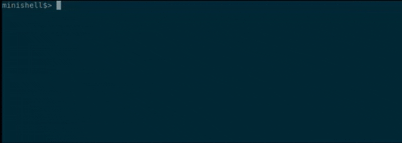

# Minishell

**Minishell** is a command language interpreter that mimics Bash. It expands text and symbols to create larger expressions that will execute commands. The shell reads input and divides it into words and operators. It then parses those tokens into commands and other constructs, removes special meaning of certain words or characters, expends others, redirects input and output as needed, executes the specified command, waits for the command's exit status and makes that exit status available for further inspection or processing. Syntax analysis is supported by an abstract syntax tree (AST). 

---

## 🎬 Demo

  

---

## ✨ Features

- **Prompt Display**: display a prompt `minishell` and wait for user input
- **Command History**: maintain a history of commands entered by the user
- **Command Execution**: search for and execute the correct executable based on the `PATH` environment variable or using a relative/absolute path
- **Quote Handling**:
   - **Single Quotes (`'`)**: Prevent the shell from interpreting meta-characters within the quotes.
   - **Double Quotes (`"`):** Prevent the shell from interpreting meta-characters within the quotes except for the `$` character.
- **Redirections**:
   - Input Redirection (`<`): Redirect input from a file.
   - Output Redirection (`>`): Redirect output to a file.
   - Append Output Redirection (`>>`): Append output to the end of a file.
   - Heredoc (`<<`): Read input until a delimiter is found.
- **Pipes (`|`)**:
   - support pipelines, allowing the output of one command to be the input of another.
- **Environment Variable Expansion**:
   - expand environment variables prefixed with `$` followed by a sequence of characters into their corresponding values.
   - handle $? which should expand to the exit status of the most recently executed foreground pipeline
- **Signal Handling**:
   - handle signals like `Ctrl+C`, `Ctrl+D`, and `Ctrl+\` appropriately, using at most one global variable for signal handling.
   - **`Ctrl+C`** (`SIGINT`): Display a new prompt on a new line.
   - **`Ctrl+D`**: Send an EOF character which can be detected as an empty input from `readline`. Exit the shell.
   - **`Ctrl+\`** (`SIGQUIT`): Do nothing.
- **Built-in Commands**:
   - `echo` with `-n` option: Display a line of text.
   - `cd` with a relative or absolute path: Change the current working directory.
   - `pwd`: Print the current working directory.
   - `export`: Set environment variables.
   - `unset`: Unset environment variables.
   - `env`: Display the environment variables.
   - `exit`: Exit the shell.

---

## ✔️ **Allowed Functions**

  - **Standard C library**: `malloc`, `free`, `write`, `read`, `close`.
  - **Input/Output**: `readline`, `rl_clear_history`, `rl_on_new_line`, `rl_replace_line`, `rl_redisplay`, `add_history`, `printf`, `perror`, `strerror`, `isatty`, `ttyname`, `ttyslot`, `tgetent`, `tgetflag`, `tgetnum`, `tgetstr`, `tgoto`, `tputs`.
  - **Process Control**: `fork`, `wait`, `waitpid`, `wait3`, `wait4`, `kill`, `exit`, `execve`.
  - **Signal Handling**: `signal`, `sigaction`, `sigemptyset`, `sigaddset`.
  - **File Operations**: `open`, `access`, `stat`, `lstat`, `fstat`, `unlink`, `opendir`, `readdir`, `closedir`, `dup`, `dup2`, `pipe`.
  - **Environment**: `getenv`, `tcsetattr`, `tcgetattr`.
  - **Directory**: `chdir`, `getcwd`.
  - **Terminal Control**: `ioctl`.

---

## 📐 **Coding standard**

Strict coding guidelines for the 42 School curriculum. Here is a concise summary of the most important aspects of this coding style:
- **Files:** Max 5 functions per file; lines ≤ 80 chars.
- **Functions:** Max 25 lines; max 4 parameters
- **Naming:** snake_case
- **Control Flow:** Only if, else, and while allowed; ❌ No for, switch, ternary (?:), or do...while ❌
- **Variables:** Declared only at the start of functions; no VLAs
- **Macros:** Only for constants; no function-like macros
- (...)

---

## 📚 **Resources**

- [Crafting Interpreters](https://craftinginterpreters.com/contents.html)
- [Bash Man](https://www.gnu.org/savannah-checkouts/gnu/bash/manual/bash.html)
- Compilers - Principles, Techniques and Tools (2nd) Pearson-2006 

---

## 🏭 **Further development**

- Write more tests
- Add the wildcards feature (*) for current working directory

---

## 📝 **Authors**

- [Tom Murua](https://github.com/tmurua) ([**tmurua**](https://profile-v3.intra.42.fr/users/tmurua))
- [David Lemaire](https://github.com/maricalmer) ([**dlemaire**](https://profile-v3.intra.42.fr/users/dlemaire))

